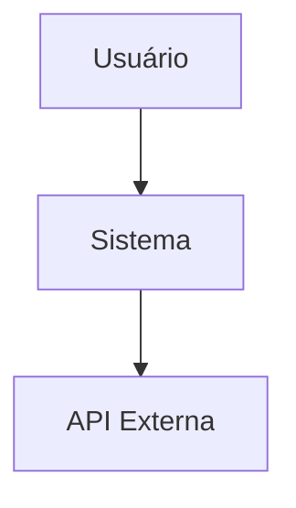
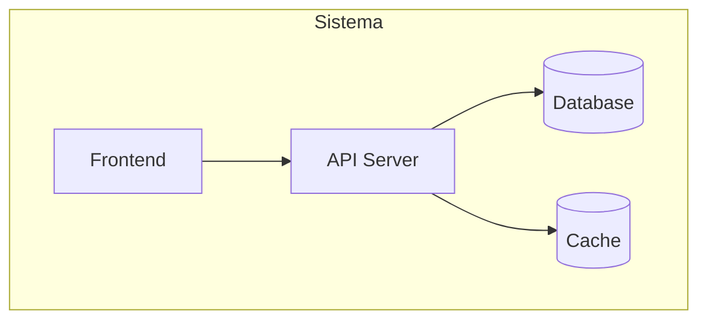
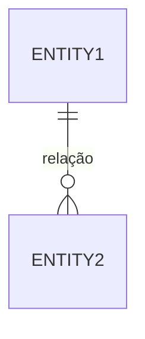

# Documento de Arquitetura: [Nome do Projeto]

**Versão:** 1.0
**Data:** YYYY-MM-DD
**Autor:** Architect Agent
**PRD Referência:** [link para PRD]
**Status:** Rascunho | Em Revisão | Aprovado

---

## 1. Visão Geral da Arquitetura

> Descrição de alto nível da arquitetura do sistema.

### 1.1 Diagrama de Contexto (C4 Level 1)
> Mermaid diagram mostrando o sistema e suas interações externas.

## 2. Stack Tecnológica

| Camada | Tecnologia | Justificativa |
|--------|------------|---------------|
| Frontend | | |
| Backend | | |
| Database | | |
| Infra | | |
| CI/CD | | |
| Monitoring | | |

## 3. Componentes do Sistema

### 3.1 Diagrama de Containers (C4 Level 2)

### 3.2 Descrição dos Componentes

| Componente | Responsabilidade | Tecnologia |
|------------|-----------------|------------|
| | | |

## 4. Modelo de Dados

### 4.1 Entidades Principais

### 4.2 Descrição das Entidades

| Entidade | Campos Principais | Notas |
|----------|------------------|-------|
| | | |

## 5. APIs e Interfaces

### 5.1 Endpoints

| Método | Rota | Descrição | Auth |
|--------|------|-----------|------|
| | | | |

### 5.2 Contratos de Dados
> Schemas JSON/TypeScript para request/response.

## 6. Requisitos Não-Funcionais

### 6.1 Performance
> Targets de latência, throughput, etc.

### 6.2 Segurança
> Autenticação, autorização, encriptação, etc.

### 6.3 Escalabilidade
> Estratégia de escala horizontal/vertical.

### 6.4 Observabilidade
> Logs, métricas, traces, alertas.

## 7. ADRs (Architecture Decision Records)

> Liste ADRs criados durante o design. Cada ADR deve estar em arquivo separado.

| # | Decisão | Status | Data |
|---|---------|--------|------|
| ADR-001 | | Aprovado/Pendente | |

## 8. Riscos Técnicos

| Risco | Probabilidade | Impacto | Mitigação |
|-------|---------------|---------|-----------|
| | | | |

## 9. Plano de Deploy

> Estratégia de deploy (blue/green, canary, rolling, etc.)

## 10. Dependências Externas

| Dependência | Tipo | SLA | Fallback |
|-------------|------|-----|----------|
| | API/SDK/Serviço | | |

---

**Aprovações:**
- [ ] Tech Lead
- [ ] Dev Team
- [ ] Stakeholder
