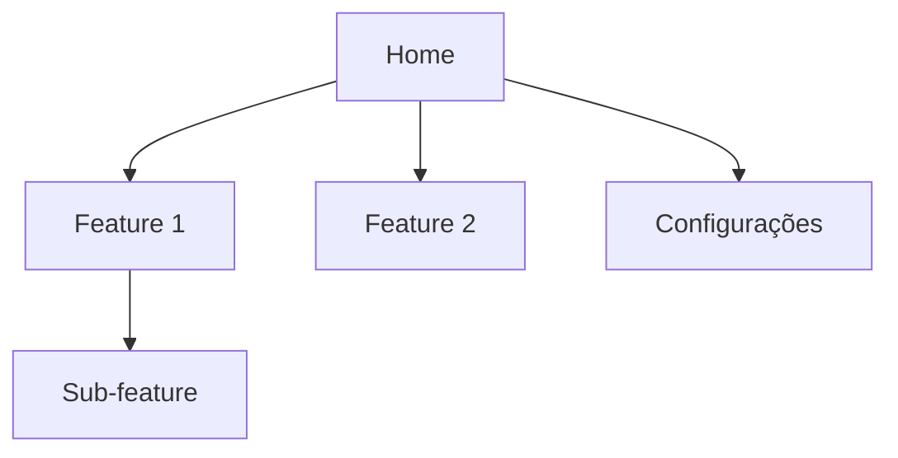
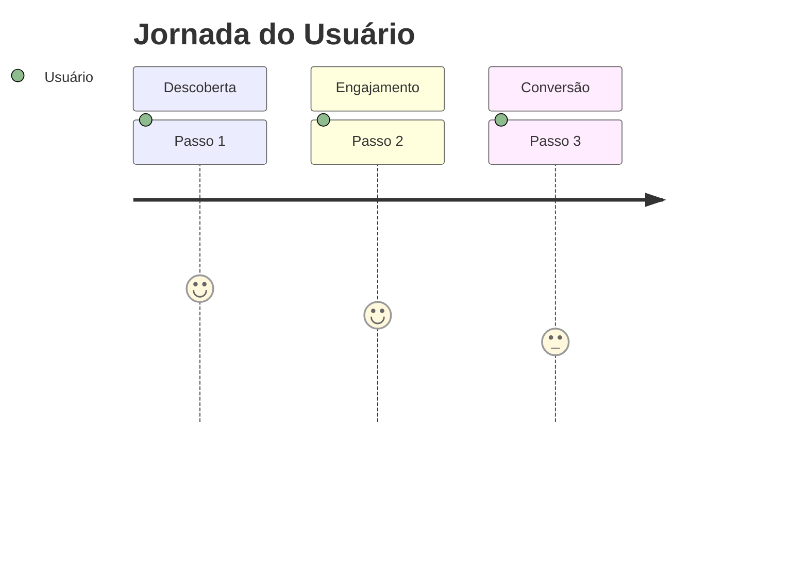

# UX Spine: [Nome do Produto]

**Data:** YYYY-MM-DD
**Autor:** UX Agent
**PRD Ref:** [link para PRD]
**Status:** Rascunho | Em Revisão | Aprovado

---

## 1. Arquitetura de Informação

### 1.1 Mapa do Site / App

### 1.2 Navegação Principal

| Item | Destino | Visível para |
|------|---------|--------------|
| | | Todos / Auth / Admin |

## 2. Personas e Jornadas

### Jornada: [Nome da Jornada Principal]

## 3. Fluxos de Tela

### Fluxo 1: [Nome do Fluxo Principal]

| Tela | Propósito | Ações Principais | Próxima Tela |
|------|-----------|-------------------|--------------|
| | | | |

### Estados de Cada Tela

| Tela | Empty | Loading | Loaded | Error |
|------|-------|---------|--------|-------|
| | | | | |

## 4. Componentes de UI

### 4.1 Design Tokens

| Token | Valor | Uso |
|-------|-------|-----|
| color-primary | | |
| color-secondary | | |
| spacing-unit | | |
| border-radius | | |
| font-family | | |

### 4.2 Componentes Reutilizáveis

| Componente | Variantes | Props |
|------------|-----------|-------|
| Button | primary, secondary, ghost | label, onClick, disabled |
| Card | default, compact | title, body, actions |
| | | |

## 5. Padrões de Interação

| Padrão | Contexto | Comportamento |
|--------|----------|---------------|
| Confirmação destrutiva | Deletar item | Modal de confirmação |
| Feedback de ação | Salvar | Toast notification |
| Loading | Requisições | Skeleton / Spinner |
| | | |

## 6. Responsividade

| Breakpoint | Layout | Navegação |
|------------|--------|-----------|
| Mobile (<768px) | | |
| Tablet (768-1024px) | | |
| Desktop (>1024px) | | |

## 7. Acessibilidade

- [ ] Contraste mínimo 4.5:1 (WCAG AA)
- [ ] Navegação por teclado completa
- [ ] Screen reader support (ARIA labels)
- [ ] Focus indicators visíveis
- [ ] Alt text em todas as imagens

---

**Aprovações:**
- [ ] PM
- [ ] Dev Lead
- [ ] Stakeholder
